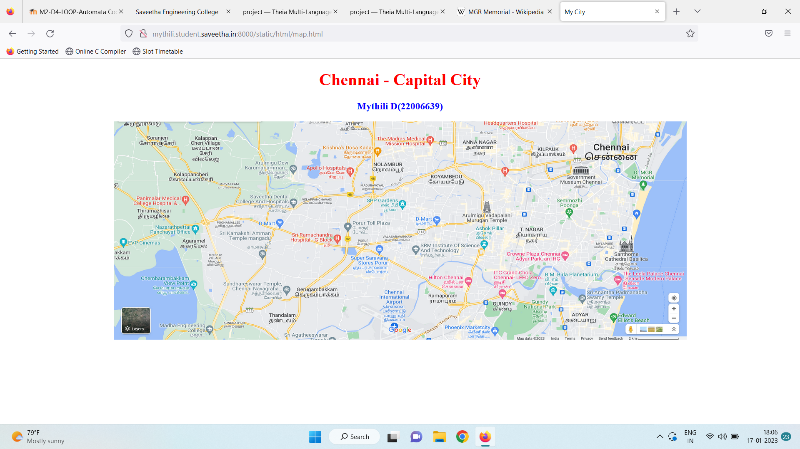
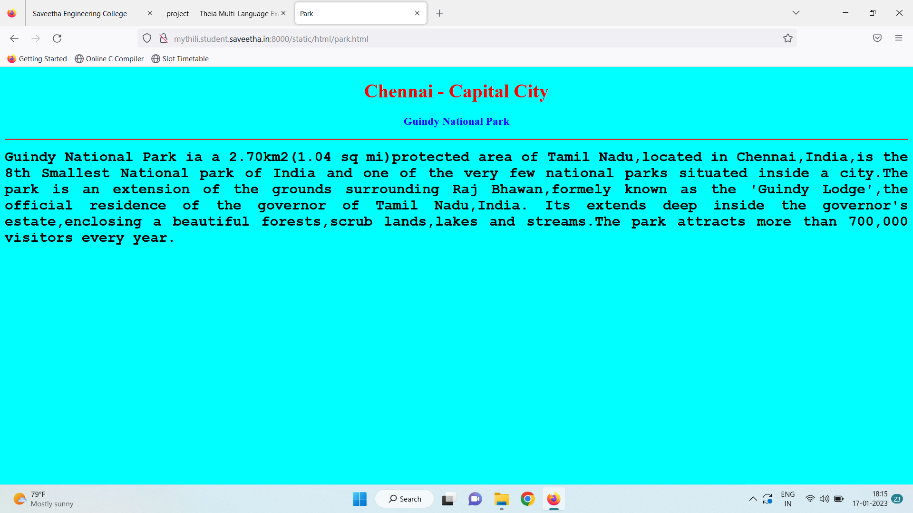
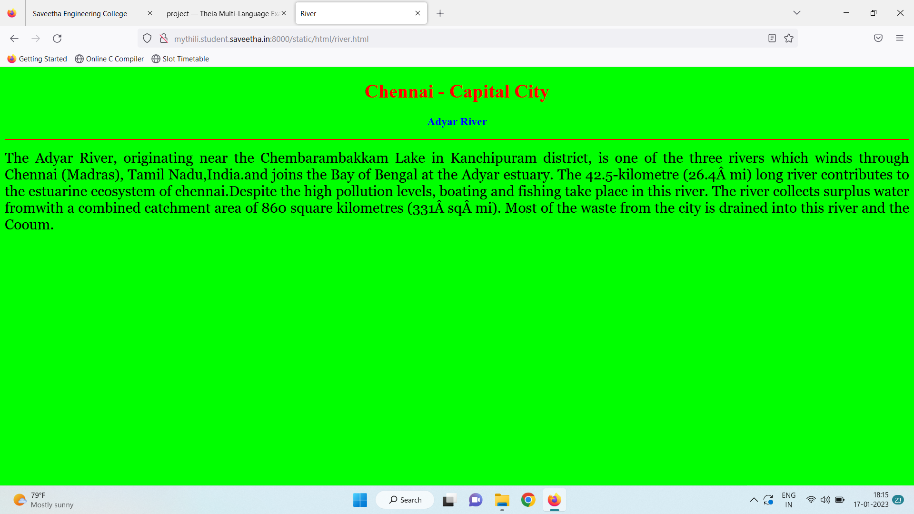
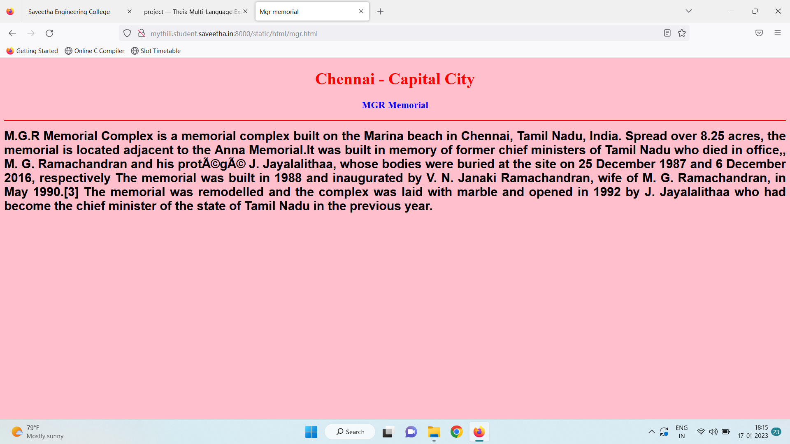
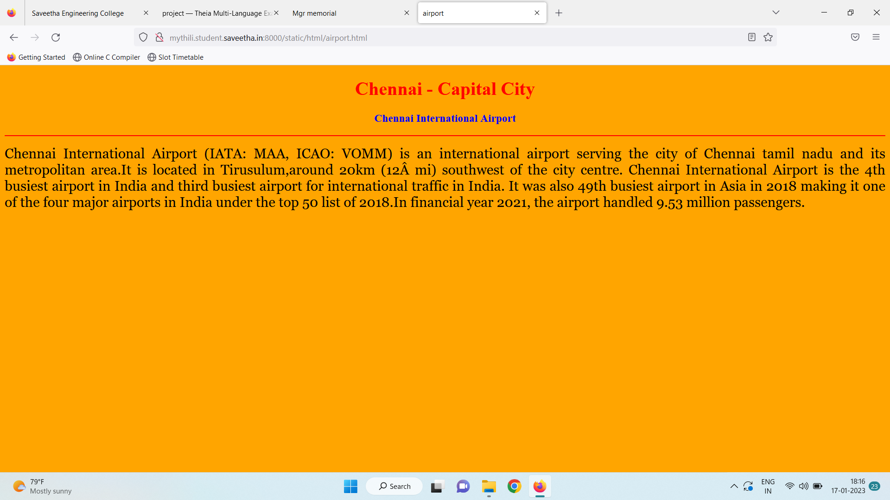
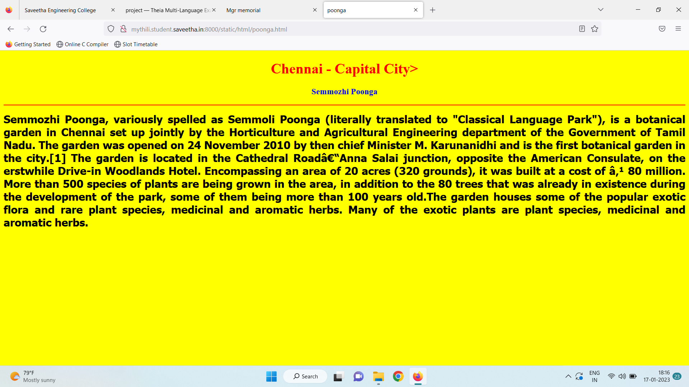
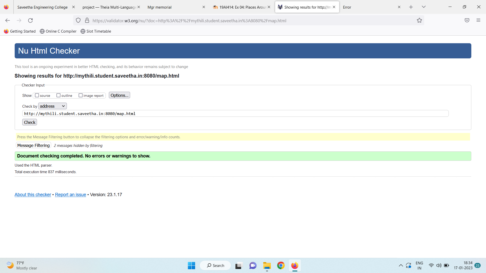

# Places Around Me
## AIM:
To develop a website to display details about the places around my house.

## Design Steps:

### Step 1:
clone the github repository into Theia IDE

### Step 2:
create a nw Django project

### Step 3:
write the needed HTML code.

### Step 4:
Run the Django server and execute the HTML files.

## Code:
```
map.html
<!DOCTYPE html>
<html lang="en">
<head>
<title>My City</title>
</head>
<body>
<h1 align="center">
<font color="red"><b>Chennai - Capital City</b></font>
</h1>
<h3 align="center">
<font color="blue"><b>Mythili D(22006639)</b></font>
</h3>
<center>

<map name="MyCity">
<area shape="circle" coords="13.0009,80.1359" href="/static/html/park.html" title="Guindy National Park">
<area shape="rectangle" coords="13.05238,80.25104aa" href="/static/html/poonga.html" title="Semmozhi Poonga">
<area shape="circle" coords="13.01367,80.26559" href="/static/html/river.html" title="Adyar River">
<area shape="circle" coords="13.351,80.176" href="/static/html/mgr.html" title="MGR Memorial">
<area shape="rectangle" coords="12.5856,80.949" href="/static/html/airport.html" title="Chennai Intenational Airport">
</map>
</center>
</body>
</html>

park.html
<!DOCTYPE html>
<html lang="en">
<head>
<title>Park</title>
</head>
<body bgcolor="cyan">
<h1 align="center">
<font color="red"><b>Chennai - Capital City</b></font>
</h1>
<h3 align="center">
<font color="blue"><b>Guindy National Park</b></font>
</h3>
<hr size="3" color="red">
<p align="justify">
<font face="Courier New" size="5">
<b>
Guindy National Park ia a 2.70km2(1.04 sq mi)protected area of Tamil Nadu,located in Chennai,India,is the 8th Smallest
National park of India and one of the very few national parks situated inside a city.The park is an extension of the grounds
surrounding Raj Bhawan,formely known as the 'Guindy Lodge',the official residence of the governor of Tamil Nadu,India. Its
extends deep inside the governor's estate,enclosing a beautiful forests,scrub lands,lakes and streams.The park attracts more
than 700,000 visitors every year.
</b>
</font>
</p>
</body>
</html>

poonga.html
<!DOCTYPE html>
<html lang="en">
<head>
<title>poonga</title>
</head>
<body bgcolor="yellow">
<h1 align="center">
<font color="red"><b>Chennai - Capital City></font>
</h1>
<h3 align="center">
<font color="blue"><b>Semmozhi Poonga</b></font>
</h3>
<hr size="3" color="red">
<p align="justify">
<font face="Tahoma" size="5">
Semmozhi Poonga, variously spelled as Semmoli Poonga (literally translated to "Classical Language Park"), 
is a botanical garden in Chennai set up jointly by the Horticulture and Agricultural Engineering department 
of the Government of Tamil Nadu. The garden was opened on 24 November 2010 by then chief Minister M.
Karunanidhi and is the first botanical garden in the city.[1] The garden is located in the Cathedral 
Road–Anna Salai junction, opposite the  American Consulate, on the erstwhile Drive-in Woodlands Hotel. 
Encompassing an area of 20 acres (320 grounds), it was built at a cost of ₹ 80 million. More than 500 species
of plants are being grown in the area, in addition to the 80 trees that was already in existence during the development 
of the park, some of them being more than 100 years old.The garden houses some of the popular exotic flora and rare 
plant species, medicinal and aromatic herbs. Many of the exotic plants are plant species, medicinal and aromatic herbs.
</font>
</p>
</body>
</html>

river.html
<!DOCTYPE html>
<html lang="en">
<head>
<title>River</title>
</head>
<body bgcolor="lime">
<h1 align="center">
<font color="red"><b>Chennai - Capital City</b></font>
</h1>
<h3 align="center">
<font color="blue"><b>Adyar River</b></font>
</h3>
<hr size="3" color="red">
<p align="justify">
<font face="Georgia" size="5">
The Adyar River, originating near the Chembarambakkam Lake in Kanchipuram district, is one of the
three rivers which winds through Chennai (Madras), Tamil Nadu,India.and joins the Bay of Bengal 
at the Adyar estuary. The 42.5-kilometre (26.4 mi) long river contributes to the estuarine ecosystem of 
chennai.Despite the high pollution levels, boating and fishing take place in this river. The river
collects surplus water fromwith a combined catchment area of 860 square kilometres (331 sq mi). 
Most of the waste from the city is drained into this river and the Cooum.
</font>
</p>
</body>
</html>

mgr.html
<!DOCTYPE html>
<html lang="en">
<head>
<title>Mgr memorial</title>
</head>
<body bgcolor="pink">
<h1 align="center">
<font color="red"><b>Chennai - Capital City</b></font>
</h1>
<h3 align="center">
<font color="blue"><b>MGR Memorial</b></font>
</h3>
<hr size="3" color="red">
<p align="justify">
<font face="Arial" size="5">
<b>
M.G.R Memorial Complex is a memorial complex built on the Marina beach in Chennai, Tamil Nadu, India. 
Spread over 8.25 acres, the memorial is located adjacent to the Anna Memorial.It was built in
memory of former chief ministers of Tamil Nadu who died in office,, M. G. Ramachandran and his protégé 
J. Jayalalithaa, whose bodies were buried at the site on 25 December 1987 and 6 December 2016, respectively
The memorial was built in 1988 and inaugurated by V. N. Janaki Ramachandran, wife of M. G. Ramachandran,
in May 1990.[3] The memorial was remodelled and the complex was laid with marble and opened in 1992 
by J. Jayalalithaa who had become the chief minister of the state of Tamil Nadu in the previous year. 
</b>
</font>
</p>
</body>
</html>
```

## Output:












## HTML Validator


## Result:
The program for implementing image map is executed successfully